# Framework
- 웹 어플리케이션을 빠르게 개발할 수 있도록 도와주는 도구
- 개발에 필요한 기본 구조, 규칙, 라이브러리 등을 제공
# Django
- Python 기반의 대표적인 웹 프레임워크
## 클라이언트와 서버
### Client
- 서비스를 요청하는 주체
- 웹 사용자의 인터넷이 연결된 장치, 웹 브라우저 등
### Server
- 클라이언트의 요청에 응답하는 주체
- 웹 페이지, 앱을 저장하는 컴퓨터<br>
    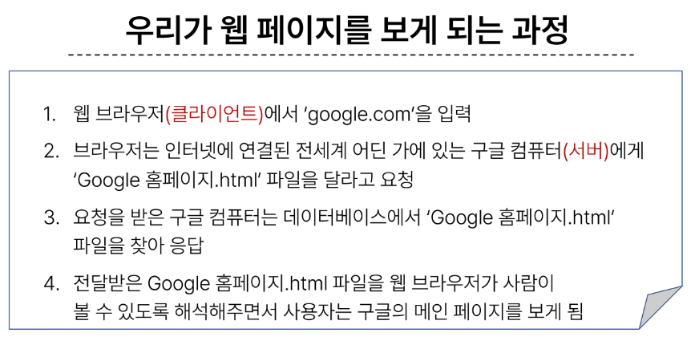<br>
## 프로젝트 및 가상환경
### 가상환경
- Python 애플리케이션과 그에 따른 패키지들을 격리하여 관리할 수 있는 **독립적인** 실행 환경
- 의존성 패키지
    - 한 소프트웨어 패키지가 다른 패키지의 기능이나 코드를 사용하기 때문에 그 패키지가 존재해야만 제대로 작동하는 관계
    - 사용하려는 패키지가 설치되지 않았거나, 호환되는 버전이 아니면 오류가 발생하거나 예상치 못한 동작을 보일 수 있음
- Django 프로젝트 생성 전 루틴
    - 가상환경 생성
    - 가상환경 활성화
    - Django 설치
    - 의존성 파일 생성
    - gitignore 생성
    - git 저장소 생성
    - Django 프로젝트 생성
### LTS *Long-Term-Support*
- 프레임워크나 라이브러리 등의 소프트웨어에서 장기간 지원되는 안정적인 버전을 의미할 때 사용
- 기업이나 대규모 프로젝트에서는 소프트웨어 업그레이드에 많은 비용과 시간이 필요하기 때문에 안정적이고 장기간 지원되는 버전이 필요
- 장고는 x.2 버전이 LTS
## 장고 프로젝트와 앱
### Django application
- 독립적으로 작동하는 기능 단위 모듈
- 각자 특정한 기능을 담당하며 다른 앱들과 함께 하나의 프로젝트를 구성
### 앱
- 앱 생성
    - 앱 이름은 '복수형'으로 지정하는 것을 권장
- 앱 등록
    - 반드시 앱을 생성한 후에 등록해야 함
    - 등록 후 생성은 불가능
## Django 디자인 패턴
### 디자인 패턴
- 소프트웨어 설계에서 발생하는 문제를 해결하기 위한 일반적인 해결책
- 공통적인 문제를 해결하는데 쓰이는 형식화 된 관행
### MVC 디자인 패턴
- Model, View, Controller
- 애플리케이션을 구조화하는 대표적인 패턴
- 데이터, 사용자 인터페이스, 비즈니스 로직을 분리
- 시각적 요소와 뒤에서 실행하는 로직을 서로 영향 없이, 독립적이고 쉽게 유지 보수를 할 수 있는 애플리케이션을 만들기 위해
### MTV 디자인 패턴
- Model, Template, View
- Django 에서 애플리케이션을 구조화하는 패턴
- 기존 MVC 패턴과 동일하나 명칭을 다르게 정의한 것
## Template System
- 데이터를 **표현**을 제어하면서, **표현**과 관련된 부분을 담당
### Django Template Language
- Template 에서 조건, 반복, 변수 등의 프로그래밍적 기능을 제공하는 시스템
- DTL Syntax
    - Variable
        - render 함수의 세번째 인자로 딕셔너리 데이터를 사용
        - 딕셔너리 key에 해당하는 문자열이 template 에서 사용 가능한 변수명이 됨
        - dot(.) 을 사용하여 변수 속성에 접근할 수 있음
    - Filters
        - 표시할 변수를 수정할 때 사용
        - chained 가 가능하여 일부 필터는 인자를 받기도 함
        - 약 60개의 built-in template filters를 제공
        - e.g. {{ name|truncatewords:30 }}
    - Tags
        - 반복 또는 논리를 수행하여 제어 흐름을 만듦
        - 일부 태그는 시작과 종료 태그가 필요
        - 약 24개의 built-in template tags를 제공
        - e.g.  
    - Comments
        - 주석
        - e.g.   or {# #}
## 템플릿 상속
- 페이지의 공통요소를 포함하고, 하위 템플릿이 재정의 할 수 있는 공간을 정의하는 기본 'skeleton' 템플릿을 작성하여 상속 구조를 구축
- extends tag
    - 자식(하위) 템플릿이 부모 템플릿을 확장한다는 것을 알림
    - 반드시 템플릿 최상단에 작성되어야 함(2개 이상 사용 불가)
    - e.g. 
- block tag
    - 하위 템플릿에서 재정의 할 수 잇는 블록을 정의
    - 하위 템플릿이 작성할 수 있는 공간을 지정
    - e.g. {% block name} {% endblock name}
## HTML form
- HTTP 요청을 서버에 보내는 가장 편리한 방법
- 'form' element
    - 사용자로부터 할당된 데이터를 서버로 전송
    - 웹에서 사용자 정보를 입력하는 여러 방식
    - text, password, checkbox 등을 제공
- 'action' & 'method'
    - action
        - 입력 데이터가 전송될 URL 을 지정
        - 만약 이 속성을 지정하지 않으면 데이터는 현재 form 이 있는 페이지의 URL로 보내짐
    - method
        - 데이터를 어떤 방식으로 보낼 것인지 정의
        - 데이터의 HTTP request methods (GET, POST)를 지정
- 'name' attribute
    - 입력한 데이터에 붙이는 이름
    - 데이터를 제출했을 때 서버는 name 속성에 설정된 값을 통해서 사용자가 입력한 데이터에 접근할 수 있음
    - Query String Parameter
        - 사용자의 입력 데이터를 URL 주소에 파라미터를 통해 서버로 보내는 방법
        - 문자열은 앰퍼샌드(&)로 연결된 key=value 쌍으로 구성되며, 기본 URL 과 물음표로 구분됨.
### HTTP request 객체
- form 으로 전송한 데이터 뿐만 아니라 모든 요청 관련 데이터가 담겨있음
- view 함수의 첫번째 인자
- e.g. requet.GET.get('message')
## Django URLs
### URL dispatcher
- URL 패턴을 정의하고 해당 패턴이 일치하는 요청을 처리할 view 함수를 연결(mapping)
### 변수와 URL
- Variable Routing
    - URL 일부터 변수를 포함시키는 것
    - 변수는 view 함수의 인자로 전달
- Variable routing 작성법
    - path_converter: variable_name
    - path converters
        - URL 변수 타입 지정
# Django Model
## Model
- Model을 통한 DB 관리
- DB의 테이블을 정의하고 데이터를 조작할 수 있는 기능들을 제공
- 테이블 구조를 설계하는 blueprint
### model 클래스 작성
- e.g.
    ```python
    # articles/models.py

    # models.Model -> 상속
    # models라는 모듈의 Model 을 상속받음
    class Article(models.Model):
        # title 은 CharField 의 인스턴스
        # Article 의 변수
        title = models.CharField(max_length=10)
        content = models.TextField()
    ```
    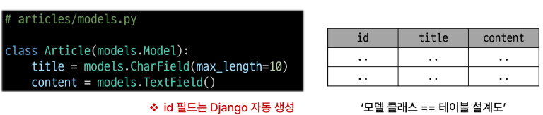
- django.db.models 모듈의 Model 이라는 부모 클래스를 상속받음
- Model은 mode에 관련된 모든 코드가 이미 작성되어 있는 클래스
- 개발자는 가장 중요한 테이블 구조를 어떻게 설계할지에 대한 코드만 작성하도록 하기 위한 것
- 클래스 변수명
    - 테이블의 각 필드(열) 이름
- model Field 클래스
    - 테이블 필드의 **데이터 타입**
- model Field 클래스 키워드 인자(필드 옵션)
    - 테이블 필드의 **제약조건** 관련 설정
    - 제약조건
        - 데이터가 올바르게 저장되고 관리되도록 하기 위한 규칙
        - e.g. 숫자만 저장되도록, 문자가 100자까지만 저장되도록 하는 등
### Migrations
- model 클래스의 변경사항(필드 생성, 수정 삭제 등)을 DB에 최종 반영하는 방법</br>
    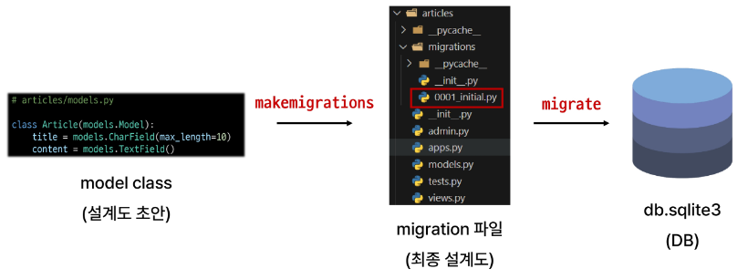</br>
    - 반드시 이 흐름대로 가야함
- 핵심 명령어
    ```
    $ python manage.py makemigrations
    $ python manage.py migrate
    ```
- 테이블에 필드 추가
    ```python
    # 필요한 필드 추가
    class Article(models.Model):
        title = models.CharField(max_length=10)
        content = models.TextField()
        created_at = models.DateTimeField(auto_now_add=True)
        updated_at = models.DateTimeField(auto_now=True)
    ```
    - 명령어를 입력한뒤 기본값을 작성
    - Djagno는 설계도를 쌓아가면서 추후 문제가 생겼을 시 복구하거나 되돌릴 수 있도록 함
    - model class에 변경사항이 생겼다면, 반드시 새로운 설계도를 생성해야 하고, 이를 DB에 반영 해야한다.
### model Field
- DB 테이블의 필드(열)을 정의하며, 해당 필드에 저장되는 데이터 타입과 제약조건을 정의
- CharField()
    - 길이의 제한이 있는 문자열을 넣을 때 사용
    - 필드의 최대 길이를 결정하는 max_legnth는 필수 인자
- TextField()
    - 글자의 수가 많을 때 사용
    - 각 DB 서비스 마다, 운영체제 마다 글자 수의 최대가 다르기 때문에 제한을 따로 두진 않음
- DateTimeField()
    - 날짜와 시간을 넣을 때 사용
    - ***auto_now***
        - 데이터가 저장될 때마다 자동으로 현재 날짜, 시간을 저장
        - 보통 수정일로 사용
    - ***auto_now_add***
        - 데이터가 처음 생성될 때만 자동으로 현재 날짜, 시간을 저장
        - 보통 작성일로 사용
## Admin site
### Automatic admin interface
- Django는 추가 설치 및 설정 없이 자동으로 관리자 인터페이스를 제공
- 데이터 확인 및 테스트 등을 진행하는데 매우 유용
### 참고
```
$ python manage.py sqlmigrate articles 0001
$ python manage.py showmigrations
```
- SQLite
    - DB 관리 시스템 중 하나이며 Django의 기본 DB로 사용
    - 파일로 존재하며 가볍고 호환성이 좋음
- CRUD
    - 소프트웨어가 가지는 기본적인 데이터 처리 기능
    - Create    저장
    - Read      조회
    - Update    갱신
    - Delete    삭제
# ORM
## ORM *Object-Relational-Mapping*
- 객체 지향 프로그래밍 언어를 사용하여 호환되지 않는 유형의 시스템간에 데이터를 변환하는 기술
- Django 와 DB 간 번역기 정도
## QureySet API
- ORM 에서 데이터를 검색, 필터링, 정렬 및 그룹화 하는데 사용하는 도구
- API를 사용하여 SQL이 아닌 Python 코드로 데이터를 처리.</br>
    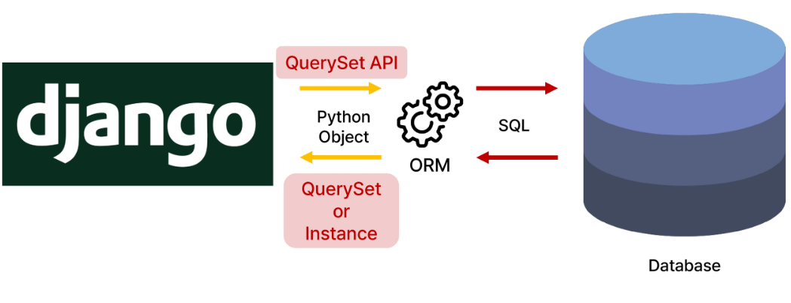</br>
- 구문 구조
    - Model class, Manager, Queryset API
    ```python
    # Modelclass.Manager.QuerysetAPI()
    Article.objects.all()
    ```
- Query</br>
    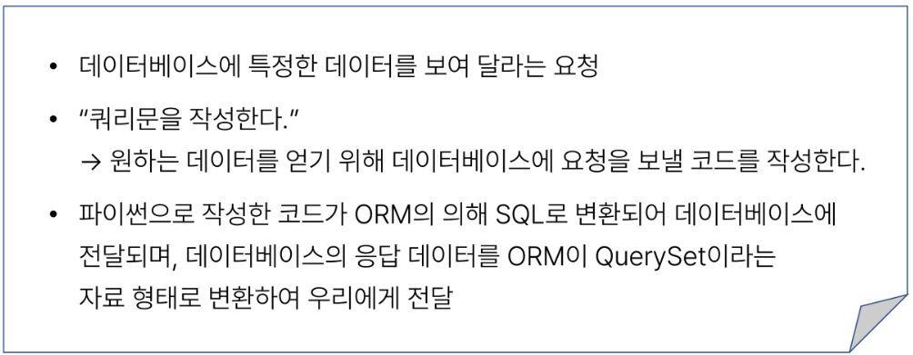</br>
- QuerySet</br>
    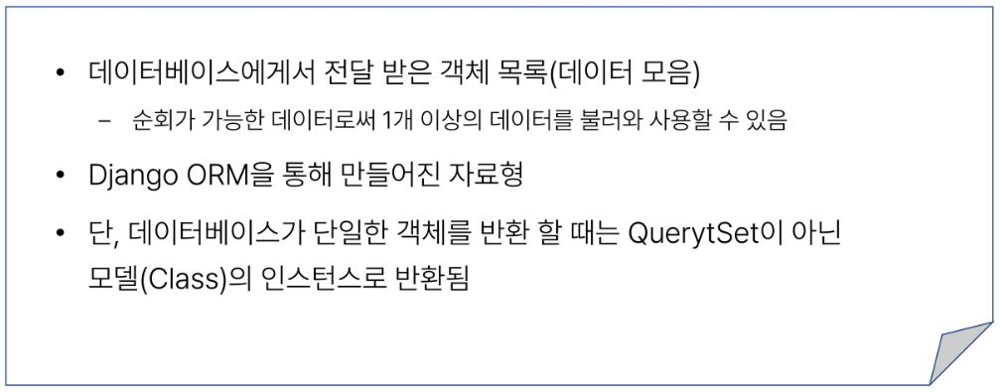</br>
- QuerySet 설치
```
$ pip install ipython
$ pip install django-extensions
```
```python
# settings.py

INSTALLED_APPS = [
    'normal apps ...',
    'django_extensions',
    'django apps ...',
]
```
- Django shelll
    - Djagno 환경 안에서 실행되는 python shell
    - 입력하는 QuerySet API 구문이 Django 프로젝트에 영향을 미침
- Create
    - python manage.py shell_plus
    - save() 객체를 DB에 저장하는 매서드
- Read
    - all() 전체 데이터 조회
    - get() 단일 테이터 조회
        - 객체를 찾을 수 없으면 DoesNotExist 예외를 발생시키고, 둘 이상의 객체를 찾으면 MultipleObjectsReturned 예외를 발생시킴
        - primary key와 같이 고유성(uniqueness)을 보장하는 조회에서 사용 해야 함
    - filter() 특정 조건 데이터 조회
    - Field lookups
        - 특정 레코드에 대한 조건을 설정하는 방법
        - QureySet 메서드 filter(), exclude() 및 get()에 대한 키워드 인자로 지정됨
        ```python
        # 'content' 레코드에 'dja'가 포함된 모든 데이터 조회
        Article.objects.filter(content__contains='dja')
        ```
- Update
    - 인스턴스 변수를 변경 후 save 메서드 호출
- Delete
    - 삭제하려는 데이터 조회 후 delete 메서드 호출
# HTTP
- HTTP request methods
    - 데이터(리소스)에 어떤 요청(행동)을 원하는지를 나타내는 것
    - **GET** & **POST**
## ***GET*** Method
- 특정 리소스를 조회하는 요청
- GET으로 데이터를 전달하면 Query String 형식으로 보내짐
## ***POST*** Method
- 특정 리소스에 변경(생성, 수정, 삭제)을 요구하는 요청
- POST로 데이터를 전달하면 HTTP Body에 담겨 보내짐
## HTTP response status code
- 특정 HTTP 요청이 성공적으로 완료되었는지를 3자리 숫자로 표현하기로 약속한 것
- 403 Frobidden
    - 서버에 요청이 전달되었지만, 권한 때문에 거절되었다는 것을 의미
## CSRF
- Cross-Site-Request-Forgery
- 사이트 간 요청 위조
- 사용자가 자신의 의지와 무관하게 공격자가 의도한 행동을 하여 특정 웹 페이지를 보안에 취약하게 하거나 수정, 삭제 등의 작업을 하게 만드는 공격 방법
- 요청 시 CSRF Token을 함께 보내야 하는 이유
    - Django 서버는 해당 요청이 DB에 데이터를 하나 생성하는(DB에 영향을 주는) 요청에 대해 **Django가 직접 제공한 페이지에서 데이터를 작성하고 있는 것 인지**에 대환 확인 수단이 필요한 것
    - 겉모습이 똑같은 위조 사이트나 정상적이지 않은 요청에 대한 방어 수단
    - 기존
        - 요청데이터 -> 게시글 작성
    - 변경
        - 요청데이터 + 인증토큰 -> 게시글 작성
- POST에서만 쓰는 이유
    - POST 는 단순 조회를 위한 GET 과 달리 특정 리소스에 변경(생성, 수정, 삭제)을 요구하는 의미와 기술적인 부분을 가지고 있기 때문
    - DB에 조작을 가하는 요청은 반드시 인증 수단이 필요
    - DB 에 대한 변경사항을 만드는 요청이기 때문에 토큰을 사용해 최소한의 신원 확인을 하는 것
## redirect
- 게시글 작성 후 완료를 알리는 페이지를 응답하는 것
- 데이터 저장 후 페이지를 주는 것이 아닌 다른 페이지로 사용자를 보내야 한다.
- redirect()
    - 클라이언트가 인자에 작성된 주소로 다시 요청을 보내도록 하는 함수
## Update
- Update 로직을 구현하기 위해 필요한 view 함수 개수는 2개
# Form
## 개요
### HTML 'form'
- 지금까지 사용자로부터 데이터를 받기위해 활용한 방법 그러나 비정상적 혹은 악의적인 요청을 필터링 할 수 없음
- 유효한 데이터인지 확인이 필요
### 유효성 검사
- 수집한 데이터가 정확하고 유효한지 확인하는 과정
- 구현
    - 입력값, 형식, 중복, 범위, 보안 등 많은 것들을 고려해야함
    - Django가 제공하는 Form 사용
## Django Form
- 사용자 입력 데이터를 수집, 처리 및 유효성 검사를 수행하기 위한 도구
- 유효성 검사를 단순화하고 자동화 할 수 있는 기능을 제공
- class
```python
# articles/forms.py
from django import forms
class ArticleForm(forms.Form):
    title = forms.CharField(max_length=10)
    content = forms.CharField()
```
## Widgets
- HTML 'input' element의 표현을 담당
## Django ModelForm
- form
    - 사용자 입력 데이터를 DB에 저장하지 않을 때 사용
    - e.g. 로그인
- ModelForm
    - 사용자 입력 데이터를 DB에 저장해야 할 때 사용
    - e.g. 게시글, 회원가입
### ModelForm
- Model 과 연결된 Form을 자동으로 생성해주는 기능
- Model + Form
- Meta class
    - ModelForm의 정보를 저장하는 곳
- is_valid()
    - 여러 유효성 검사를 실행하고, 데이터가 유효한지 여부를 Boolean 으로 변환
- 공백 데이터가 유효하지 않은 이유와 에러메시지가 출력되는 과정
    - 별도로 명시하지 않았지만 모델 필드에는 기본적으로 빈 값은 허용하지 않는 제약조건이 설정되어 있음
    - 빈 값은 is_valid()에 의해 False로 평가되고 form 객체에는 그에 맞는 에러 메시지가 포함되어 다음 코드로 진행됨
- save() 메서드가 생성과 수정을 구분하는 법
    - 키워드 인자 instance 여부를 통해 생성할 지, 수정할 지를 결정
### Djnago Form 정리
- 사용자로부터 데이터를 수집하고 처리하기 위한 강력하고 유연한 도구
- HTML form 의 생성, 데이터 유효성 검사 및 처리를 쉽게 할 수 있도록 도움
- new & create view 함수간 공통점과 차이점
    - 공통점 : 데이터 생성을 구현하기 위함
    - 차이점 : new 는 GET method 요청만을, create 는 POST method 요청만을 처리
# Static filse
### static filse
- 서버측에서 변경되지 않고 고정적으로 제공되는 파일
- 이미지 js css 등
## 웹 서버와 정적 파일
- 웹 서버의 기본동작은 특정 위치 URL에 있는 자원을 요청 HTTP request 받아서 응답 HTTP response 을 처리하고 제공 serving 하는 것
- 이는 "자원에 접근 가능한 주소가 있다"라는 의미
- 웹서버는 요청받은 URL로 서버에 존재하는 정적 자원을 제공
- 정적 파일을 제공하기 위한 경로 URL 가 있어야 함
## Static Files 제공하기
- 기본 경로에서 제공
    - 기본경로 : app folder/static/app_name/
- 추가 경로에서 제공
### STATIC_URL
- 기본 경로 및 추가 경로에 위치한 정적 파일을 참고하기 위한 URL 
- 실제 파일이나 디렉토리가 아니며, URL로만 존재
- 추가 경로 생성
    - STATICFILES_DIRS에 문자열 값으로 추가 경로 설정
## Media Files
- 사용자가 웹에서 업로드하는 정적 파일 user-uploaded
## 이미지 업로드
- ImageField()
    - 이미지 업로드에 사용하는 모델 필드
    - 이미지 객체가 직접 저장되는 것이 아닌 **이미지 파일의 경로**가 문자열로 DB에 저장
- 미디어 파일을 제공하기 전 준비
    - settings.py 에 MEDIA_ROOT, MEDIA_URL 설정
    - 작성한 MEDIA_ROOT와 MEDIA_URL에 대한 url 지정
- MEDIA_ROOT
    - 미디어 파일들이 위치하는 디렉토리의 절대 경로
    ```python
    # settings.py
    MEDIA_ROOT = BASE_DIR / 'media'
    ```
- MEDIA_URL
    - MEDIA_ROOT에서 제공되는 미디어 파일에 대한 주소를 생성
    - STATIC_URL과 동일한 역할
    ```python
    # settings.py
    MEDIA_URL = 'media/'
    ```
- MEDIA_ROOT와 MEDIA_URL에 대한 url 지정
    - 업로드 된 파일의 URL == settings.MEDIA_URL
    - 위 URL을 통해 참조하는 파일의 실제 위치 == settings.MEDIA_ROOT<br>
    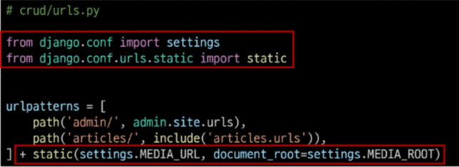<br>
### 이미지 업로드
- blank = True 속성을 작성해 빈 문자열이 저장될 수 있도록 제약 조건 설정
    - 이미지 업로드를 선택사항으로 만들기 위함<br>
    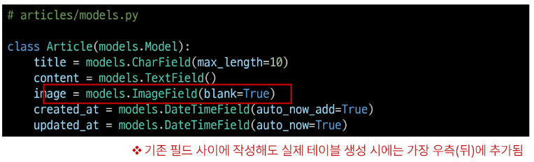<br>
- migration 진행
    - pip install Pillow
    - Pillow : 파이썬 상에서 이미지 처리를 위한 라이브러리
- form 요소의 enctype 속성 추가<br>
    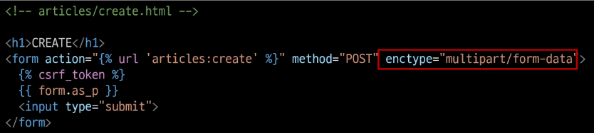<br>
- view 함수에서 업로드 파일에 대한 추가 코드 작성<br>
    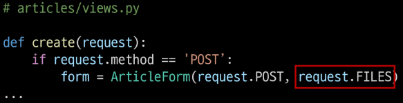<br>
### 업로드 이미지 제공
- 'url'속성을 통해 업로드 파일의 경로 값을 얻을 수 있음
    - content_name.image.url : 업로드 파일의 경로
    - content_name.image : 업로드 파일의 파일 이름
- 이미지를 업로드하지 않은 게시물은 detail 템플릿을 렌더링 할 수 없음
    - 이미지 데이터가 있는 경우만 이미지를 출력할 수 있도록 처리<br>
    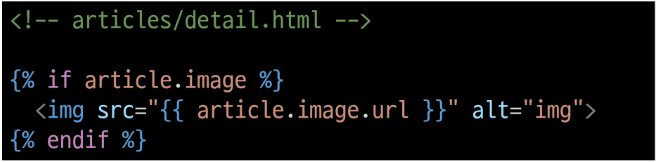<br>
### 업로드 이미지 수정
- 수정 페이지 form 요소에 eenctype 속성 추가<br>
    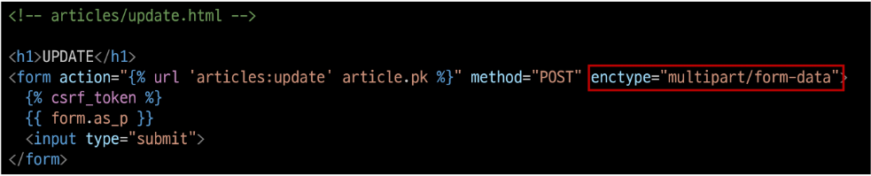<br>
- update view 함수에서 업로드 파일에 대한 추가 코드 작성<br>
    <br>
### 참고
- 'upload_to' argument
    - ImageField()의 upload_to 인자를 사용해 미디어 파일 추가 경로 설정<br>
        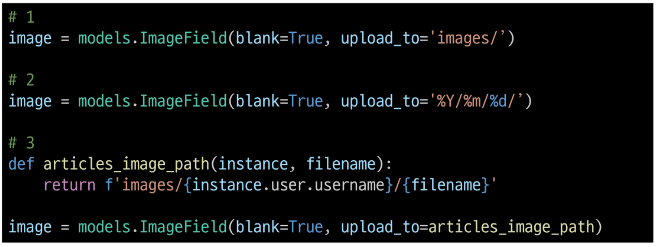<br>
- request.FILES 가 두번째 위치 인자인 경우
    - ModelForm 상위 클래스 BaseModelForm의 생성자 함수 키워드 인자
# Auth
# Cookie & Session
- 우리가 서버로부터 받은 페이지를 둘러볼 때 우리는 서버와 서로 연결되어 있는 상태가 아니다
## HTTP
- HTML 문서와 같은 리소스들을 가져올 수 있도록 해주는 규약
- 웹(WWW)에서 이루어지는 모든 데이터 교환의 기초
### 특징
- 비 연결 지향 connectionless
    - 서버는 요청에 대한 응답을 보낸 후 연결을 끊음
- 무상태 stateless
    - 연결을 끊는 순간 클라이언트와 서버간의 통신이 끝나며 상태정보가 유지되지 않음
## 쿠키 Cookie
- 서버가 사용자의 웹 브라우저에 전송하는 작은 데이터 조각
- 클라이언트 측에서 저장되는 작은 데이터 파일이며, 사용자 인증, 추적, 상태 유지 등에 사용되는 데이터 저장 방식<br>
    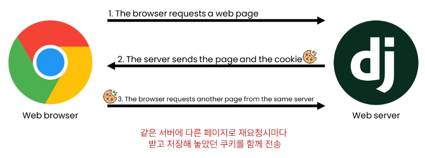<br>
### 사용 원리
- 브라우저(클라이언트)는 쿠키를 KEY-VALUE의 데이터 형식으로 저장
- 동일한 서버에 재요청 시 저장된 쿠키를 함께 전송
- 쿠키는 두 요청이 동일한 브라우저에서 들어왔는지 아닌지를 판단할 때 주로 사용됨
    - 이를 이용해 사용자의 로그인 상태를 유지할 수 있음
    - 상태가 없는 HTTP 프로토콜에서 상태 정보를 기억 시켜 주기 때문
### 목적
- 세션관리 Session management
    - 로그인, 아이디 자동완성, 공지 하루 안 보기, 팝업 체크, 장바구니 등의 정보 관리
- 개인화 Personalization
    - 사용자 선호, 테마 등의 설정
- 트래킹 Tracking
    - 사용자 행동을 기록 및 분석
### 세션 Session
- 서버 측에서 생성되어 클라이언트와 서버 간의 상태를 유지
- 상태 정보를 저장하는 데이터 저장 방식
- 쿠키에 세션 데이터를 저장하여 매 요청시마다 세션 데이터를 함게 보냄
- 작동원리<br>
    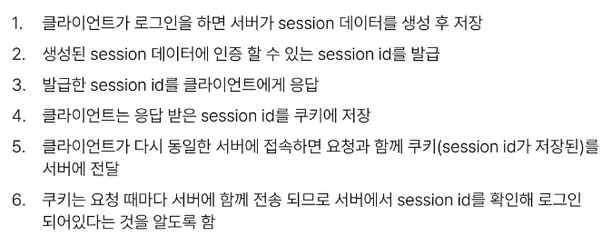<br>
- 서버 측에서는 세션 데이터를 생성 후 저장하고 세션 ID를 생성 이 ID를 클라이언트 측으로 전달하여, 클라이언트는 쿠키에 이 ID를 저장
- 서버로부터 쿠키를 받아 브라우저에 저장하고, 클라이언트가 같은 서버에 재요청 시마다 저장해 두었던 쿠키도 요청과 함게 전송
- e.g. 로그인 상태 유지를 위해 로그인 되어있다는 사실을 입증하는 데이터를 매 요청마다 계속해서 보내는것
### 쿠키와 세션의 목적
- 서버와 클라이언트 간의 상태를 유지
### 쿠키 종류별 Lifetime 수명
- Session cookie
    - 현재 세션이 종료되면 삭제
    - 브라우저 종료와 함께 세션이 삭제
- Persistent cookies
    - expires 속성에 지정된 날짜 혹은 Max-Age 속성에 지장된 기간이 지나면 삭제됨<br>
    <br>
# Authentication System
## Django Authentication System
- 사용자 인증과 관련된 기능을 모아 놓은 시스템
## Authentication
- 사용자가 자신이 누구인지 확인하는 것(신원확인)<br>
    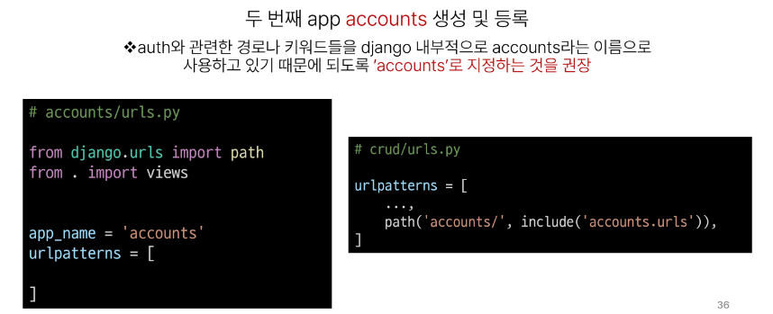<br>
## Custom User model
- Custom user model로 **대체**하기
    - django가 기본적으로 제공하는 User model은 내장된 auth 앱의 User 클래스를 사용
### User 클래스를 대체하는 이유
- 우리는 지금까지 별도의 User클래스 정의 없이 내장된 User클래스를 사용했음
- 별도의 설정없이 사용할 수 있어 간편하지만, 개발자가 직접 수정할 수 없는 문제가 존재
### 대체 단계
- AbstractUser를 상속받는 커스텀 User 클래스 작성
- 기존 user 클래스도 AbstractUser를 상속받기 때문에 커스텀 User 클래스도 기존 User클래스와 완전히 같은 모습을 가지게됨
    ```python
    # accounts/models.py
    from django.contrib.auth.models import AbstractUser

    class User(AbstractUser):
        pass
    ```
- django 프로젝트가 사용하는 기본 User 모델을 우리가 작성한 User모델로 지정
    - 수정 전 기본 값은 'auth.User'
    ```python
    # settings.py
    AUTH_USER_MODEL = 'accounts.User'
    ```
- 기본 User 모델이 아니기 대문에 등록하지 않으면 admin site에 출력되지 않음
    ```python
    # accounts/admin.py
    from django.contrib import admin
    from django.contrib.auth.admin import UserAdmin
    from .models import User

    # Register your models here.
    admin.site.register(User, UserAdmin)
    ```
- 프로젝트 중간에 AUTH_USER_MODEL을 변경할 수 없음
    - 이미 프로젝트가 진행되고 있을 경우 DB 초기화 후 진행<br>
    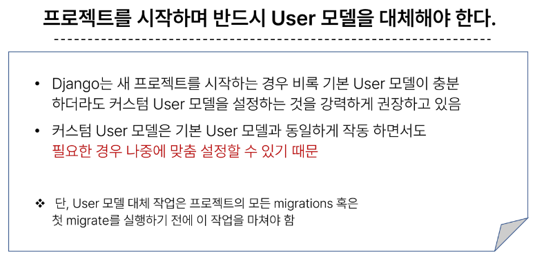<br>
## Login
- Session을 Create 하는 과정
### AuthenticationForm()
- 로그인 인증에 사용할 데이터를 입력 받는 built-in form
- 작성
```python
# accounts/urls.py

app_name = 'accoutns'
urlpatterns = [
    path('login/', views.login, name='login'),
]

# accounts/views.py
from django.contrib.auth.forms import AuthenticationForm
from django.contrib.auth import login as auth_login

# Create your views here.
def login(request):
    if request.method=='POST':
        form = AuthenticationForm(request, request.POST)
        if form.is_valid():
            auth_login(request, form.get_user())
            return redirect('articles:index')
    else:
        form = AuthenticationForm()
    context = {
        'form': form,
    }
    return render(request, 'accounts/login.html', context)
```
```html
<!-- accounts/login.html -->
<h1>로그인</h1>
<form action="" method="POST">

{{ form.as_p }}
<input type="submit">
</form>
```
- login(request, user)
    - AuthenticationForm을 통해 인증된 사용자를 로그인 하는 함수
- get_user()
    - AuthenticationForm의 인스턴스 매서드
    - 유효성 검사를 통과했을 경우 로그인 한 사용자 객체를 반환
### Logout
- logout(requet)
    - 현재 요청에 대한 Session Data를 DB에서 삭제
    - 클라이언트의 쿠키에서도 Session Id를 삭제
- 로직 작성
```python
# accounts/urls.py
urlpatterns = [
    path('login/', views.login ,name='login'),
    path('logout/', views.logout ,name='logout'),
]

# accounts/views.py
from django.contrib.auth import logout as auth_logout

def logout(request):
    auth_logout(request)
    return redirect('articles:index')
```
```html
<form action="">

<input type="submit" value='LOGOUT'>
</form>
```
### Template with Authentication data
- 템플릿에서 인증 관련 데이터를 출력하는 방법
- context processors
    - 템플릿이 렌더링 될 때 호출 가능한 컨텍스트 데이터 목록
    - 작성된 컨텍스트 데이터는 기본적으로 템플릿에서 사용 가능한 변수로 포함됨
    - django에서 자주 사용되는 데이터 목록을 미리 템플릿에 로드 해 둔것<br>
    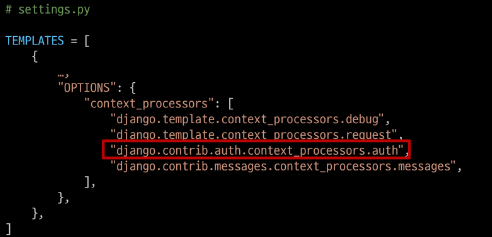<br>
### 참고
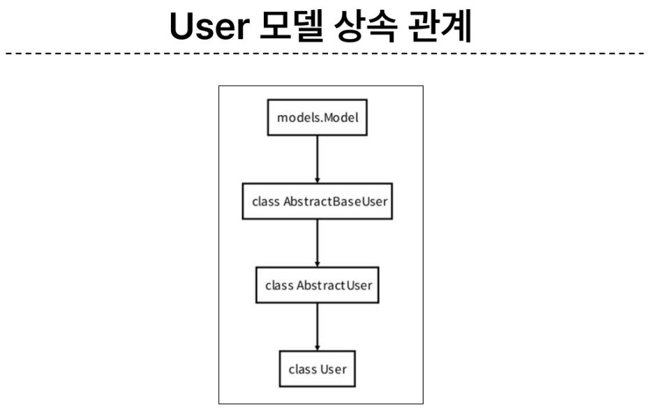<br>

-  AbstractUser class
    - 관리자 권한과 함께 완전한 기능을 가지고 있는 Usermodel 을 구현하는 추상 기본 클래스
    - 몇 가지 공통 정보를 여러 다른 모델에 넣을 때 사용하는 클래스
    - DB 테이블을 만드는데 사용되지 않으며, 대신 다른 모델의 기본 클래스로 사용되는 경우 해당 필드가 하위 클래스의 필드에 추가됨