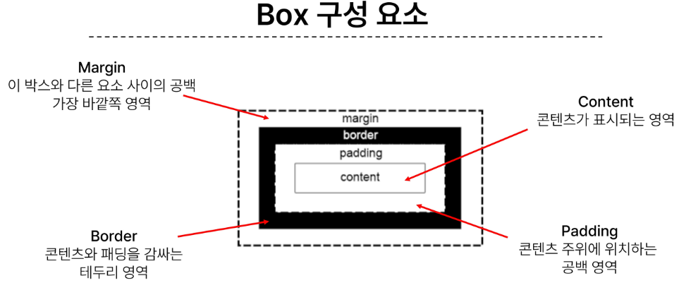
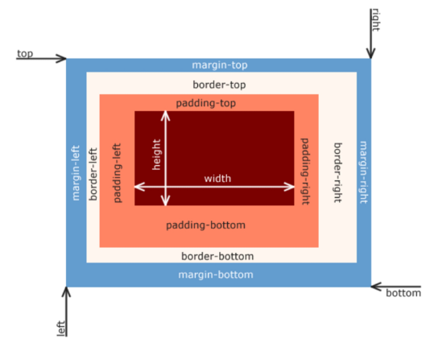
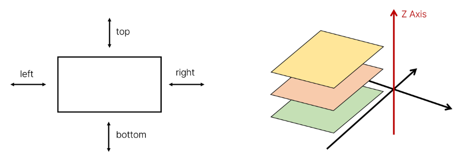
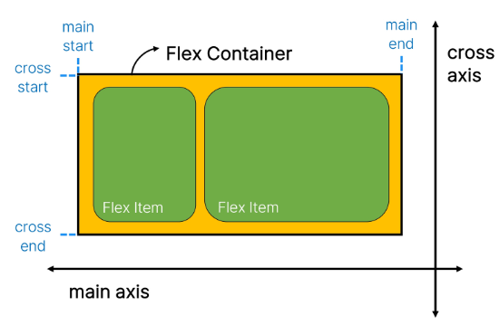
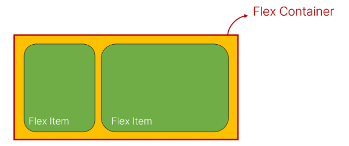

# 웹
## 웹 소개
- World Wide Web 인터넷으로 연결된 컴퓨터들이 정보를 공유하는 거대한 정보 공간
- Web
    - Web site, Web application 등을 통해 사용자들이 정보를 검색하고 상호 작용하는 기술
- Web site
    - 인터넷에서 여러 개의 Web page가 모인 것으로, 사용자들에게 정보나 서비스를 제공하는 공간
- Web page
    - HTML, CSS 등의 웹 기술을 이용하여 만들어진, **Web site**를 구성하는 하나의 요소
- Web page 구성 요소
    - HTML -> Structure
    - CSS -> Styling
    - JavaScript -> Behavior
## 웹 구조화
### HTML
- *HyperText Markup Language*
- 웹 페이지의 의미와 **구조**를 정의하는 언어
- 프로그래밍 언어는 아님
- Hypertext
    - 웹 페이지를 다른 페이지로 연결하는 링크
    - 참조를 통해 사용자가 한 문서에서 다른 문서로 즉시 접근할 수 있는 텍스트
- Markup Language
    - 태그 등을 이용하여 문서나 데이터의 구조를 명시하는 언어
    - e.g. HTML, Markdown
- html structure
    - !DOCTYPE html
        - 해당 문서가 html 문서라는 것을 나타냄
    - html /html
        - 전체 페이지의 콘텐츠 포함
    - title /title 
        - 브라우저 탭 및 즐겨찾기 시 표시되는 제목으로 사용
    - head /head 
        - html 문서에 관련된 설명, 설정 등
        - 사용자에게 보이지 않음
    - body /body 
        - 페이지에 표시되는 모든 콘텐츠
- HTML Attributes 속성 
     
    - 규칙
        - 속성은 요소 이름과 속성 사이에 공백이 있어야 함
        - 하나 이상의 속성들이 있는 경우엔 속성 사이에 공백으로 구분
        - 속성 값은 열고 닫는 따옴표로 감싸야함
    - 목적
        - 나타내고 싶진 않지만 추가적인 기능, 내용을 담고 싶을 때 사용
        - CSS에서 해당 요소를 선택하기 위한 값으로 활용됨
- HTML text structure
    - 주요 목적 중 하나는 텍스트 구조와 의미를 제공하는 것
    - 웹 페이지의 의미와 구조를 정의하는 언어
    - e.g. h1 요소는 단순히 텍스트를 크게만 만드는 것이 아닌 현재 문서의 최상위 제목이라는 의미를 부여하는 것
    - Heading & Paragraps : h1~6, p
    - Lists : ol, ul, li
    - Emphasis & Importance : em, strong
### CSS
- *Cascading Style Sheet*
- 웹 페이지의 디자인과 레이아웃을 구성하는 언어
- CSS 적용법
    - Inline 스타일 : html 요소안에 style 속성 값으로 작성
    - Internal 스타일 시트 : head 태그 안에 style 태그에 작성
    - External 스타일 시트 : 별도의 CSS 파일 생성 후 HTML link 태그를 사용해 불러오기
- CSS Selectors
    - HTML 요소를 선택하여 스타일을 적용할 수 있도록 하는 선택자
    - 기본 선택자
        - 전체(*) 선택자
        - 요소(tag) 선택자
        - class 선택자
            - 주어진 클래스 속성을 가진 모든 요소를 선택
        - id 선택자
            - 주어진 아이디 속성을 가진 요소 선택
            - 문서에는 주어진 아이디를 가진 요소가 하나만 있어야 함
        - 속성(attr) 선택자
    - 결합자 Combinators
        - 자손 결합자 (" "(space))
            - 첫 번째 요소의 자손 요소들 선택
            - e.g. p span 은 p 안에 있는 모든 span 를 선택(하위 레벨 상관 없이)
        - 자식 결합자 (>)
            - 첫 번째 요소의 직계 자식만 선택
            - e.g. ul > li 은 ul 안에 있는 모든 li를 선택(한단계 아래 자식들만)
- Specificity 우선순위
    - 동일한 요소에 적용 가능한 같은 스타일을 두 가지 이상 작성 했을 때 어떤 규칙이 적용 되는지 결정하는 것
    - Cascade 계단식
        - 동일한 우선순위를 같는 규칙이 적용될 때 CSS에서 마지막에 나오는 규칙이 적용됨
    - 우선순위
        1. Importance : !important
        2. Inline 스타일
        3. 선택자 : id 선택자 > class 선택자 > 요소 선택자
        4. 소스 코드 순서
    - 우선순위를 고려하기 어려워서, 보통 class로 만들어서 사용
    - !important
        - 다른 우선순위 규칙보다 우선하여 적용하는 키워드
        - 사용하는 것을 권하지 않음
### 권장사항
- 요소 tag 이름은 대소문자를 구분하지 않지만 소문자 사용을 권장
- 속성의 따옴표는 작은 따옴표와 큰 따옴표를 구분하지 않지만 큰 따옴표 권장
-  HTML은 프로그래밍 언어와 달리 에러를 반환하지 않기 때문에 작성시 주의
- CSS와 HTML 구조 정보가 혼합되어 작성되기 때문에 코드를 이해하기 어렵게 만듦
- CSS의 모든 속성을 외우는 것이 아님
- 속성은 되도록 class 만 사용할 것
### 궁금한거 생겼을 때
how to rander image in html ***mdn***
# CSS Layout
- 각 요소의 위치와 크기를 조정하여 웹 페이지의 디자인을 결정하는 것
- Display, Position, Float, Flexbox 등
## CSS Box Model
- content, margin, padding, border 로 구성 
    
- 명칭 
     
- width & height 속성
    - 요소의 너비와 높이를 지정, 이때 지정되는 요소의 너비와 높이는 **콘텐츠 영역**을 대상으로 함
## Box type
### Block & Inline
- display 속성에 각각 blsck inline 값을 가짐
- Block
    - 항상 새로운 행으로 나뉨
    - width와 height 속성을 사용하여 너비와 높이를 지정할 수 있음
    - 기본적으로 width 속성을 지정하지 않으면 박스는 inline 방향으로 사용가능한 공간을 모두 차지함 -> 너비를 사용가능한 공간의 100%로 채우는 것
    - e.g. h1~6, p, div
- Inline
    - 새로운 행으로 나뉘지 않음
    - width와 height 속성을 사용할 수 없음
    - 수직 방향
        - padding, margins, borders 가 적용되지만 다른요소를 밀어낼 수 없음
    - 수평 방향
        - padding, margins, borders 가 적용되어 다른 요소를 밀어낼 수 있음
    - e.g. a, img, span 
    
- inline-block
    - inline과 block 요소 사이의 중간 지점을 제공하는 display 값
    - block 요소의 특징을 가짐
        - width height 속성 사용 가능
        - padding, margin, border로 인해 다른요소가 밀려남
    - 요소가 줄 바꿈 되는 것을 원하지 않으면서 너비와 높이를 적용하고 싶은 경우에 사용
- none
    - 요소를 화면에 표시하지않고, 공간조차 부여되지 않음
## CSS Position
- 요소를 Normal Flow에서 제거하여 다른 위치로 배치하는 것
- 다른 요소 위에 올리기, 화면의 특정 위치에 고정시키기 등
- 이동방향 
     
- static
    - 기본값
    - 요소를 Normal Flow 에 따라 배치
- relative
    - 요소를 Normal Flow 에 따라 배치
    - 자기 자신을 기준으로 이동
    - 요소가 차지하는 공간은 static 일 때와 같음
- absolute
    - 요소를 Normal Flow 에서 제거
    - 가장 가까운 relative 부모 요소를 기준으로 이동
    - 문서에서 요소가 차지하는 공간이 없어짐
- fixed
    - 요소를 Normal Flow 에서 제거
    - 현재 화면영역 Viewport 을 기준으로 이동
    - 문서에서 요소가 차지하는 공간이 없어짐
- sticky
    - 요소를 Normal Flow 에 따라 배치
    - 요소가 일반적인 문서 흐름에 따라 배치되다가 스크롤이 특정 임계점에 도달하면 그 위치에 고정됨 fixed
    - 만약 다음 sticky 요소가 나오면 다음 sticky 요소가 이전 sticky 요소의 자리를 대체
        - 이전 sticky 요소가 고정되어 있던 위치와 다음 sticky 요소가 고정되어야 할 위치가 겹치게 되기 때문
- z-index
    - 정수 값을 사용해 Z축 순서를 지정
    - 더 큰 값을 가진 요소가 작은 값의 요소를 덮음
## CSS Layout Flexbox
- 요소를 행과 열 형태로 배치하는 1차원 레이아웃 방식
    - 공간 배열 & 정렬
- Flexbox 기본 사항 
     
- main axis 주 축
    - flex item 들이 배치되는 기본 축
    - main start 에서 시작하여 main end 방향으로 배치
- cross axis 교차 축
    - main 축의 수직인 축
### ***Flex Container***
- display: flex; 혹은 display: inline-flex; 가 설정된 부모요소
- 이 컨테이너의 1차 자식 요소들이 Flex Item이 됨
- flexbox 속성 값들을 사용하여 자식 요소 Flex Item들을 배치 
     
1. flex Container 지정
    - flex item 은 기본적으로 행으로 나열
    - flex item 은 주축의 시작 선에서 시작
    - flex item 은 교차축의 크기를 채우기 위해 늘어남
2. flex-direction 지정
    - flex item 이 나열되는 방향을 지정
    - column 으로 지정할 경우 주 축이 변경 됨
    - -reverse 로 지정하면 시작 선과 끝 선이 서로 바뀜
3. flex-wrap
    - flex item 목록이 flex container 의 하나의 행에 들어가지 않을 경우 다른 행에 배치할지 여부 설정
4. justify-content
    - 주 축을 따라 flex item 과 주위에 공간을 분배
5. align-content
    - 교차 축을 따라 flex item 과 주위에 공간을 분배
        - flex-wrap 이 wrap 또는 wrap-reverse 로 설정된 여러 행에만 적용됨
        - 한 줄 짜리 행에는 flex-wrap 이 nowrap 으로 설정된 경우 효과 없음
6. align-items
    - 교차 축을 따라 flex item 행을 정렬
7. align-self
    - 교차 축을 따라 개별 flex item 을 정렬
- flex box 속성
    - Flex Container
        - display, flex-direction, flex-wrap, justify-content, align-items, align-content
    - Flex Item 관련 속성
        - align-self, flex-grow, flex-basis, order
    - 배치 : flex-direction, flex-wrap
    - 공간 분배 : justify-content, align-content
    - 정렬 : align-items, align-self
8. flex-grow
    - 남는 행 여백을 비율에 따라 각 flex item 에 분배
        - 아이템이 컨테이너 내에서 확장하는 비율을 지정
    - flex-grow <-> flex-shrink
9. flex-basis
    - flex item 의 초기 크기 값을 지정
    - flex-basis 와 width 값을 동시에 적용한 경우 flex-basis 가 우선
# Bootstrap
- CSS 프론트엔드 프레임워크 Toolkit
- 미리 만들어진 다양한 디자인 요소들을 제공하여 웹사이트를 빠르고 쉽게 개발할 수 있도록 함
