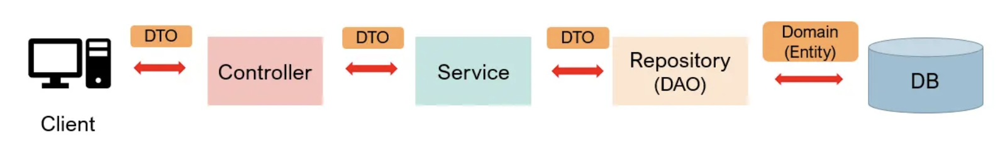

# 23/12/23
## 빌드 관리 도구
- 프로젝트에서 작성한 java 코드와 프로젝트 내에 필요한 각종 xml, properties, jar 파일들을 JVM 이나 WAS가 인식할 수 있도록 패키징 해주는 빌드 과정 혹은 빌드 자동화 도구 라고 할 수 있음.
- 프로젝트 생성, 테스트 빌드, 배포 등의 작업을 위한 전용 프로그램이라 할 수 있음.
- App을 개발하면서 일반적으로 개발에 필요한 다양한 외부 라이브러리들을 다운로드하고, 해당 라이브러리를 사용하여 개발해야하는 상황이 있는데, 이 때 각 라이브러리들을 모두 직접 다운로드 할 필요 없이, 빌드도구 설정파일에 필요한 라이브러리 종류와 버전들, 종속성 정보를 명시하여 필요한 라이브러리 설정파일을 통해 자동으로 다운로드 해주고 관리해주는 도구.
### Maven
- Java 용 프로젝트 관리도구로써 Apache의 Ant 대안으로 만들어짐.
- 빌드 중인 프로젝트, 빌드 순서, 다양한 외부 라이브러리 종속성 관계를 pom, xml 파일에 명시함.
- 외부저장소에서 필요한 라이브러리와 플러그인들을 다운로드 한다음, 로컬시스템의 캐시에 모두 저장.
### Gradle
- Apache Maven과 Apache Ant에서 볼 수 있는 개념들을 사용하는 대안으로써 나온 프로젝트 빌드 관리 툴(완전한 오픈소스).
- Groovy 언어를 사용한 Domain-specific-language를 사용(xml 설정파일을 사용하는 Maven 보다 활씬 간결함).
- 2007년에 처음 개발되었고, 2013년에 구글에 의해 안드로이드 프로젝트의 빌드 시스템으로 채택됨.
- 꽤나 큰 규모로 예상되는 multi-project 빌드를 도울 수 있도록 디자인 되었음.
- Gradle은 프로젝트의 어느 부분이 업데이트되었는지 알기 때문에, 빌드에 점진적으로 추가할 수 있음 &rarr; 즉, 업데이트가 이미 반영된 빌드의 부분은 더이상 재실행 되지 않음. &rarr; 빌드시간의 단축
- 현재 JVM 생태계에서 가장 많이 사용되는 빌드 시스템.
- Maven의 단점을 보완하기 위해 등장.
### Maven vs. Gradle
- Gradle은 ***작업 의존성 그래프***를 기반으로 함
- Maven은 ***고정적이고 선형적인 단계의 모델***을 기반으로 함
- 성능 측면에서는 둘 다 다중 모듈 빌드를 병렬로 실행할 수 있지만, Gradle은 어떤 task가 업데이트되었고 안되었는지를 체크하기 때문에 incremental build를 허용함. 이미 업데이트된 테스크에 대해서는 작업이 실행되지 않으므로 빌드시간이 Maven에 비해 단축됨. &rarr; 빌드 설정 규모가 점점 커지면 커질수록, 빌드시간의 차이도 Maven과 비교하여 괘 격차가 벌어질 수 있을 것으로 보임.
- maven 의 경우 멀티 프로젝트에서 특정 설정을 다른 모듈에서 사용하려면 상속을 받아야 하지만 gradle은 설정 주입 방식을 제공함.
- Gradle은 concurrent에 안전한 캐시를 허용함. &rarr; 2개 이상의 프로젝트에서 동일한 캐시를 사용할 경우, 서로 overwrite되지 않도록 checksum 기반의 캐시를 사용하고, 캐시를 repositrory와 동기화 시킬 수 있음.

# Spring Structure
- 스프링 패키지를 나눌때 전체적인 그림은 다음과 같음.<br>
    <br>
## Entity
- DB table에 존재하는 Column들을 필드로 가지는 객체를 뜻함. Entity는 DB의 테이블과 1대1 대응이며, 테이블에 가지지 않는 클래스를 상속받거나 필드로 가져서는 안됨.
- Entity 클래스는 다른 클래스를 상속받거나 인터페이스의 구현처여서는 안되고 순수한 데이터 객체인 것이 좋음(중복되는 경우 baseEntity를 만들어 상속 가능).
- e.g.
    ```java
        @Entity
        public class Employee {
            @Id
            private Long id;
            private String name;
            private int age;
        }
    ```
- 만약 스프링에서 JPA를 사용한다면 Entity 클래스에 @Entity 어노테이션을 붙여 해당 클래스가 Entity 클래스임을 명시할 수 있음.
- id 칼럼에는 @Id 어노테이션을 붙일 수 있고 다른 칼럼에는 @Column 어노테이션을 붙여 다양한 기능을 사용할 수 있음.
## DTO *Data Transfer Object*
- 데이터를 Transfer 하기 위한 객체
- Client 가 Controller에 요청을 보낼 때도 RequestDto의 형식으로 데이터가 이동하고, Controller가 Client에게 응답을 보낼 때도 ResponseDto의 형태로 데이터를 보내게 됨.
- Controller와 Service, Repository 계층 사이에 데이터가 오갈 때도 데이터는 DTO의 형태로 이동하게 됨.
- DTO는 로직을 갖고있지 않은 순수한 데이터 객체이며, 일반적으로 getter/setter 메서드만을 가짐.
- 하지만 DTO는 단순히 데이터를 옮기는 용도이기 때문에 굳이 Setter를 이용해 값을 수정할 필요가 없이, 생성자만을 사용하여 값을 할당하는 게 좋음.
### 사용하는 이유
- View Layer와 DB Layer의 역할을 분리하기 위해.
    <br><t>&rarr; 객체를 표현하기 위한 계층과 저장하는 계층의 역할을 분리하기 위해.
- Entity 객체의 변경을 피하기 위해.
    <br><t>&rarr; Entity 객체를 그대로 사용하면 프로그래머의 의도와 다르게 데이터가 변질될 수 있음.
- View와 통신하는 DTO 클래스는 자주 변경됨.
    <br><t>&rarr; View(클라이언트)와 통신하는 DTO 클래스, ResponseDTO, RequestDTO는 요구사항에 따라 자주 변경됨. 어떤 요청에는 특정값이 추가될 수도 있고, 특정값이 없을수도 있음. 따라서 Entity 클래스와 분리하여 관리해야함.
- 도메인 모델링을 지키기 위함.
    <br><t>도메인 설계를 잘했다고 하더라도 원하는 데이터를 표시하기가 쉽지 않을 수 있음. 예를 들어 Entity 클래스의 특정 컬럼들을 조합하여 특정 포맷을 출력하고 싶을 때, Entity클래스에 표현을 위한 필드나 로직이 추가되면 객체 설계를 망가뜨릴 수 있음. 따라서 DTO에 표현을 위한 로직을 추가해서 사용하는 것이 Entity의 도메인 모델링을 지킬 수 있음.
## DAO(Data Access Object)
- 실제로 DB에 접근하는 객체.
- Service와 실제 DB 연결하는 역할을 담당. &rarr; DB에서 데이터를 꺼내오거나 넣는 역할.
- JPA의 경우 Repository가 DAO의 역할을 함. 그렇다고 해서 DAO와 Repository가 같은 것은 아니다.
    ```
    DAO와 REPOSITORY 모두 퍼시스턴스 로직에 대한 객체-지향적인 인터페이스를 제공하고 도메인 로직과 퍼시스턴스 로직을 분리하여 관심의 분리(separation of concerns) 원리를 만족시키는데 목적이 있다. 그러나 비록 의도와 인터페이스의 메서드 시그니처에 유사성이 존재한다고 해서 DAO와 REPOSITORY를 동일한 패턴으로 취급하는 것은 성급한 일반화의 오류를 범하는 것이다.
    DAO는 퍼시스턴스 로직인 Entity Bean을 대체하기 위해 만들어진 개념이다. DAO가 비록 객체-지향적인 인터페이스를 제공하려는 의도를 가지고 있다고 하더라도 실제 개발 시에는 하부의 퍼시스턴스 메커니즘이 데이터베이스라는 사실을 숨기려고 하지 않는다. DAO의 인터페이스는 데이터베이스의 CRUD 쿼리와 1:1 매칭 되는 세밀한 단위의 오퍼레이션을 제공한다. 반면 REPOSITORY는 메모리에 로드된 객체 컬렉션에 대한 집합 처리를 위한 인터페이스를 제공한다. DAO가 제공하는 오퍼레이션이 REPOSITORY 가 제공하는 오퍼레이션보다 더 세밀하며, 결과적으로 REPOSITORY에서 제공하는 하나의 오퍼레이션이 DAO의 여러 오퍼레이션에 매핑되는 것이 일반적이다. 따라서 하나의 REPOSITORY 내부에서 다수의 DAO를 호출하는 방식으로 REPOSITORY를 구현할 수 있다.
    ```
## Controller
- Controller 는 Client의 요청을 DTO의 형태로 받아 Service의 기능을 호출하고, 적절한 응답을 DTO의 형태로 반환하는 역할을 함.
- 요청과 응답을 관리하는 계층.
## Service
- Service 계층은 DTO를 통해 받은 데이터를 이용해 비즈니스 로직을 처리하고, DAO(혹은 Repository)를 통해 DB에 접근하여 데이터를 관리함.
## Repository(DAO)
- JPA를 사용하면 Repository를 통해 DB에 실제로 접근할 수 있음.
- Service 와 DB를 연결해주는 역할을 하며, Service 계층에서 Repository를 이용하여 데이터를 관리할 수 있음.
#### 출처
- [지수의 콘텐츠 기록장](https://jisooo.tistory.com/entry/Spring-%EB%B9%8C%EB%93%9C-%EA%B4%80%EB%A6%AC-%EB%8F%84%EA%B5%AC-Maven%EA%B3%BC-Gradle-%EB%B9%84%EA%B5%90%ED%95%98%EA%B8%B0)
- [[Spring]Gradle vs Maven written by YuKeon](https://medium.com/@yukeon97/spring-gradle-vs-maven-81b58ea3c96c)
- [코드 연구소 스프링 패키지 구조, DAO, DTO, Entity, Repository에 대하여, DTO를 사용하는 이유](https://code-lab1.tistory.com/201)