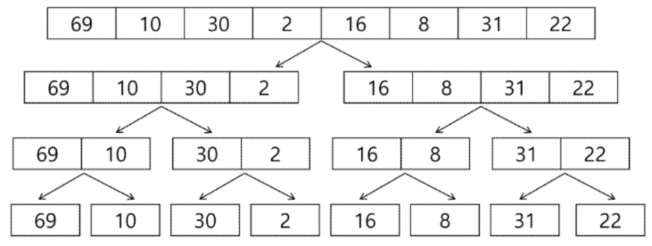
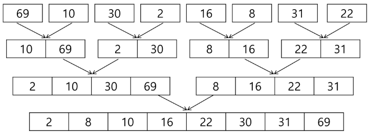

# 분할 정복
- e.g. 가짜 동전 찾기</br>
    </br>
    - 작은 문제로 쪼개서 보기
## 설계 전략
- Divide : 해결 할 문제를 더이상 나눌 수 없을 때 까지 여러 개의 작은 부분으로 나눔
- Conquer : 나눈 작은 문제를 각각 해결
- Combine : (필요하다면) 해결된 해답으로 모음
### 거듭 제곱
- 분할 정복 기반의 알고리즘
- $Olog_2n$</br>
    </br>
## 병합정렬과 퀵정렬
- 병합 정렬과 퀵 정렬은 과거 면접 단골 질문 중 하나였음
- 분할 정복 학습에 좋음
- 직접 구현할 일은 없음
- 코드를 보기 전에 손으로 해보는 것이 좋음
### 병합 정렬 *Merge Sort*
- 여러 개의 정렬된 자료의 집합을 병합하여 한 개의 정렬된 집합으로 만드는 기법
- 위부 정렬의 기본이 되는 정렬 알고리즘
- 멀티 코어 CPU 나 다수의 프로세서에서 정렬 알고리즘을 병렬화하기 위해 병합정렬 알고리즘 활용
- 자료를 최소 단위의 문제까지 나눈 후에 차례대로 정렬하여 최종 결과를 도출
- *top-down* 방식
- 시간복잡도 : $O(nlogn)$
- 병합정렬 과정
- 분할단계 : 전체 자료 집합에 대하여, 최소 크기의 부분집합이 될 때까지 분할</br>
    </br>
- 병합단계 : 2개의 부분집합을 정렬하면서 하나의 집합으로 병합</br>
    </br>
- code
    - pesudo code 구현
    ```python
    def merge(left, right):
        result = []

        while len(left) > 0 or len(right) > 0:
            if len(left) > 0 and len(right) 0:
                if left[0] <= right[0]:
                    result.append(left.popleft())
                else:
                    result.append(right.popleft())
            elif len(left) > 0:
                result.append(left.popleft())
            elif len(right) > 0:
                result.append(right.popleft())
        return result

    def merge_sort(List, m):
        if len(m) == 1:
            return m
        left = []
        right = []
        mid = len(m)//2
        for x in List[:mid]:
            left.append(x)
        for x in List[mid:]:
            right.append(x)
        
        left = merge_sort(left, m)
        right = merge_sort(right, m)

        return merge(left, right)
    ```
### 퀵 정렬 *Quick Sort*
- 주어진 배열을 두 개로 분할하고, 각각을 정렬
- 매우 큰 입력 데이터에 대해서 좋은 성능을 보이는 알고리즘
- 기준 아이템 *pivot item* 중심으로, 이보다 작은 것은 왼편, 큰 것은 오른편에 위치
- 아이디어
    - P(pivot) 값들 보다 큰 값은 오른쪽, 작은 값들은 왼쪽 집합에 위치하도록 한다.
    - P 를 두 집합의 가운데에 위치시킨다.
- 로직
    - pivot 값을 고른다.
        - 왼쪽 끝 / 오른쪽 끝 / 가운데, 임의의 세개 값 중에 중간 값
    - 값을 제외 하고 앞에서부터, 뒤에서 부터 각각 값을 찾음
    - 찾은 값의 위치 교체
    - 작은 값과 pivot 값의 위치 교체
    - pivot 이후 값에서 동일과정 진행
- Code
    - base
        ```python
        def quickSort(A, l, r):
            if l < r:
                s = partition(a, l, r)
                quickSort(A, l, s - 1)
                quickSort(A, s + 1, r)
        ```
    - partitions
        - Lomuto partition Algorithmn
            ```python
            def partition(A, p, r):
                x = A[r]
                i = p - 1
                for j in range(p, r):
                    if A[j] <= x:
                        i += 1
                        A[i], A[j] = A[j], A[i]
                A[i+1], A[r] = A[r], A[i+1]
                return i  + 1
            ```
        - Hoare partition Algorithmn
            ```python
            def partition(A, l, r):
                p = A[l]
                i, j = l, r
                while i <= j:
                    while i <= j and A[i] <= p:
                        i += 1
                    while i <= j and A[i] >= p:
                        j -= 1
                    if i < j:
                        A[i], A[j] = A[j], A[i]
                A[l], A[j] = A[j], A[l]
                return j
            ```
## 이진 검색
- 코테 단골 유형
- 자료의 가운데에 있는 항목의 키 값과 비교하여 다음 검색의 위치를 결정하고 검색을 계속 진행하는 방법
    - 목적 키를 찾을 때 까지 이진 검색을 순환적으로 반복 수행함으로써 검색 범위를 반으로 줄여가면서 보다 빠르게 검색을 수행
- 이진 검색을 하기 위해서는 자료가 정렬된 상태여야 함
- $O(logN)$
- 검색 과정
    - 자료의 중앙에 있는 원소를 고름
    - 중앙 원소의 값과 찾고자 하는 목표 값을 비교
    - 목표 값이 중앙 원소의 값보다 작으면 자료의 왼쪽 반에서, 크다면 오른쪽 반에서 새로 검색을 수행
- 보통 재귀 형태로 구현
- code
    ```python
    def binSearch(a, low, high, key):
        if low > high:
            return -1
        else:
            mid = (low + high) // 2
            if key == a[mid]:
                return mid
            elif key < a[mid]:
                return binSearch(a, low, mid - 1, key)
            else:
                return binSearch(a, mid + 1, high, key)
    ```
