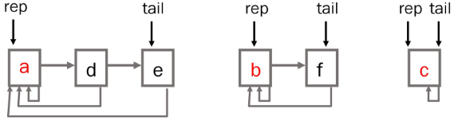
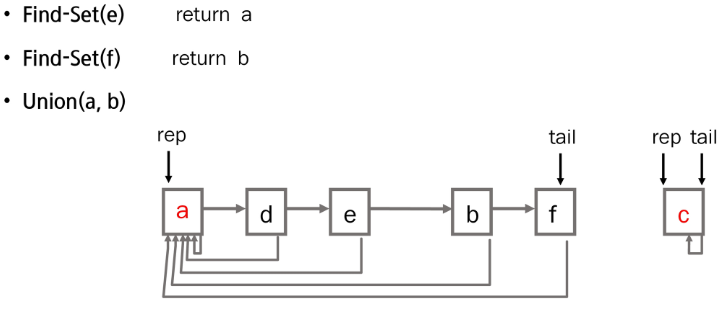
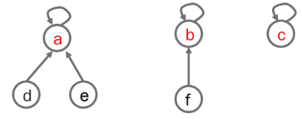
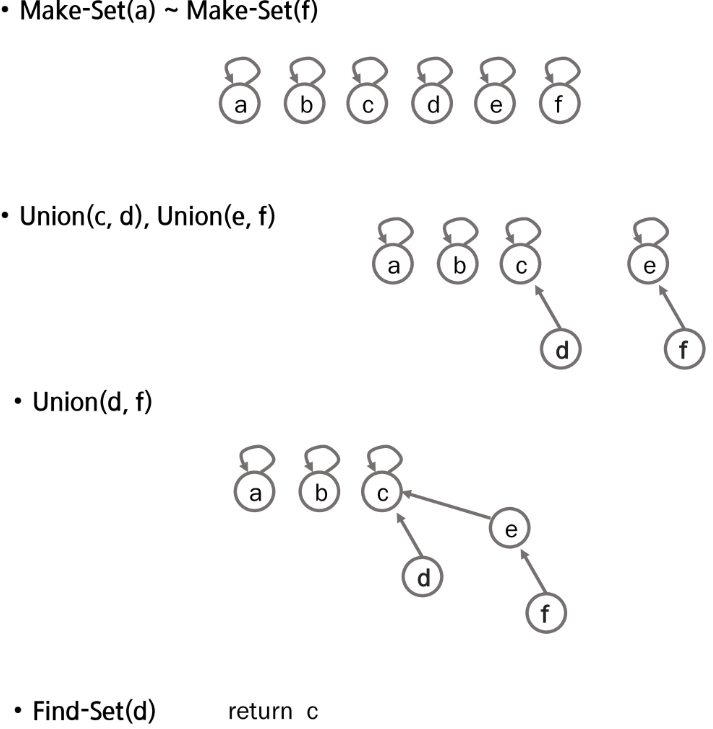
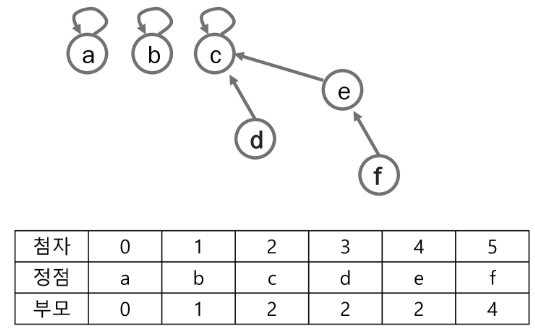
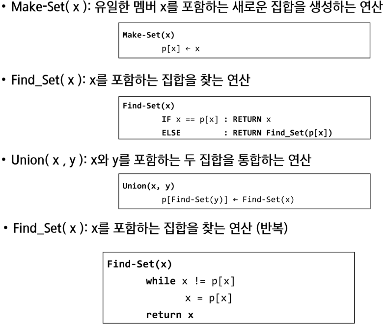
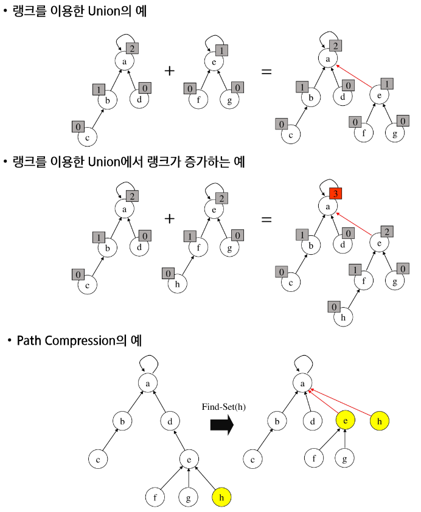

# 서로소 집합 *Disjoint-sets*
- 서로소 또는 상호배타 집합들은 서로 중복 포함된 원소가 없는 집합들
- 교집합이 없음
- 집합에 속한 하나의 특정 멤버를 통해 각 집합들을 구분 -> 대표자 *representative*
- 표현 방법
    - 연결 리스트
    - 트리
- 연산
    - Make-Set(x)
    - Find-Set(y)
    - Union(x, y)
## 표현
### 연결리스트
- 같은 집합의 원소들은 하나의 연결리스트로 관리
- 연결리스트의 맨 앞의 원소를 집합의 대표 원소로 함
- 각 원소는 집합의 대표원소를 가리키는 링크를 가짐<br>
    <br>
- e.g.<br>
    <br>
### 트리
- 하나의 집합 *a disjoint set* 을 하나의 트리로 표현
- 자식 노드가 부모 노드를 가리키며 루트 노드가 대표자가 됨<br>
    <br>
- e.g.<br>
    <br>
- 상호배타 집합을 표현한 트리의 배열을 이용해 저장된 모습<br>
    <br>
## 연산
- 
### 효율을 높이는 방법
- Rank를 이용한 Union
    - 각 노드는 자신을 루트로 하는 subtree 의 높이를 랭크 Rank 라는 이름으로 저장
    - 두 집합을 합칠 때 rank가 낮은 집합을 rank 가 높은 집합에 붙임
- Path compression
    - Find-Set을 행하는 과정에서 만나는 모든 노드들이 직접 root를 가리키도록 포인터를 바꿈
- e.g.<br>
    <br>
## Code
```python
# make set
parent = [i for i in range(10)]

# find parenet
def find_set(x):
    if parent[x] == x:
        return x
    
    # 경로 압축
    parent[x] = finds_set(parent[x])
    return find_set(parent[x])

# union two sets
def union(x, y):
    x = find_set(x)
    y = find_set(y)

    # 대표자가 같으면 같은 집합
    if x == y: return

    # 다른 집합이면 같은 대표자로 수정
    if x < y:
        parent[y] = x
    else:
        parent[x] = y
```