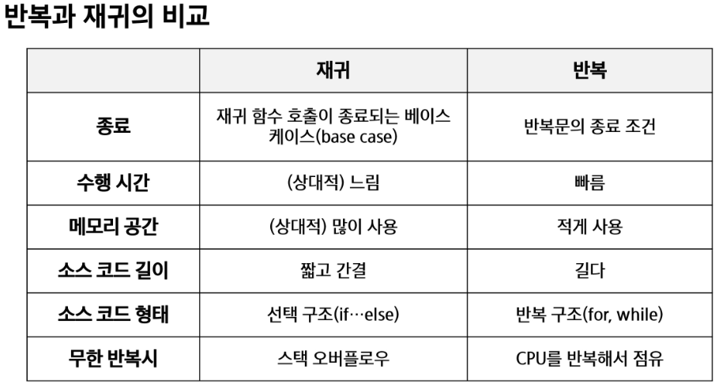
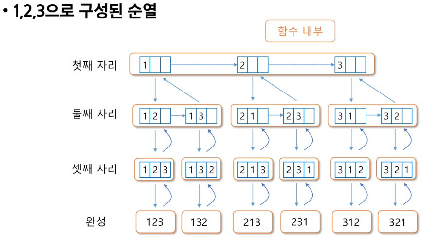
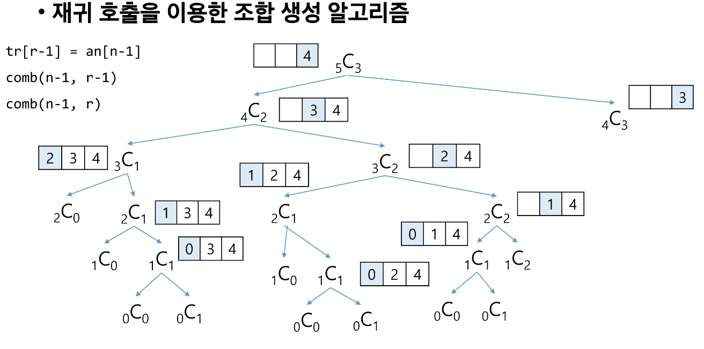
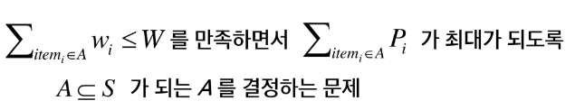
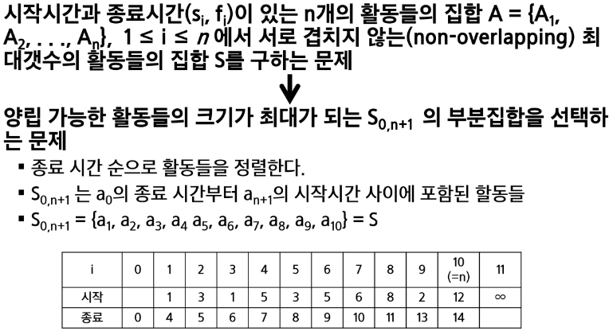

# 완전 검색 & 그리디
## 반복과 재귀
- 반복과 재귀는 유사한 작업을 수행 할 수 있다.
- 반복은 수행하는 작업이 완료될 때 까지 계속 반복
- 재귀는 주어진 문제의 해를 구하기 위해 동일하면서 더 작은 문제의 해를 이용하는 방법
    - 하나의 큰 문제를 해결할 수 있는 (해결하기 쉬운) 더 작은 문제로 쪼개고 결과들을 결합한다.
- 재귀적 알고리즘
    - 재귀적 정의는 두 부분으로 나뉜다
    - 하나 또는 그 이상의 기본경우 basis case or rule
        - 집합에 포함되어 있는 원소로 induction 을 생성하기 위한 seed 역할
        - 하나 또는 그 이상의 유도된 경우 inductive case or rule
            - 새로운 집합의 원소를 생성하기 위해 결합되어지는 방법
- 재귀 함수 recursive function
    - 함수 내부에서 직접 혹은 간접적으로 자기 자신을 호출하는 함수
    - 일반적으로 재귀적 정의를 이용해서 재귀 함수를 구현한다
    - basis part 와 유도부분(inductive part) 로 구분
    - 함수 호출은 프로그램 메모리 구조에서 스택을 사용한다. 따라서 재귀 호출은 반복적인 스택의 사용을 의미하며 메모리 및 속도에서 성능저하가 발생한다.
- 해결할 문제를 고려해서 반복이나 재귀의 방법을 선택
- 재귀는 문제 해결을 위한 알고리즘 설계가 간단하고 자연스럽다
    - 추상 자료형(list, tree 등)의 알고리즘은 재귀적 구현이 간단하고 자연스러운 경우가 많다
- 일반적으로 재귀적 알고리즘은 Iterative 알고리즘보다 더 많은 메모리와 연산을 필요로 한다
- 입렵 값 n 이 커질수록 재귀 알고리즘은 반복에 비해 비효율적일 수 있다</br>
    </br>
## 완전검색 기법
- 문제를 해결하기 위한 간단하고 쉬운 접근법
- brute-force 의 force 는 컴퓨터의 force 를 의미한다.
- 상대적으로 빠른 시간에 문제 해결(알고리즘 설계)을 할 수 있다.
- 문제에 포함된 자료(요소, 인스턴스)의 크기가 작다면 유용
- 학술적 또는 교육적 목적을 위해 알고리즘의 효율성을 판단하기 위한 척도로 사용
### 완전검색을로 시작
- 모든 경우의 수를 생성하고 테스트 하기 때문에 수행 속도는 느리지만, 해답을 찾아내지 못할 확률이 낮다.
- 이를 기반으로 그리디 기법이나 동적 계획법을 이용해서 효율적인 알고리즘을 찾을 수 있다.
- 주어진 문제를 풀 때, 우선 완전 검색으로 접근하여 해답을 도출 한 후, 성능 개선을 위해 다른 알고리즘을 사용하고 해답을 확인한다.
### 완전 검색
- 많은 종류의 문제들이 특정 조건을 만족하는 경우나 요소를 찾는 것
- 이들은 전형적으로 순열(permutation), 조합(combination), 부분집합(subset) 과 같은 조합적 문제들(combiation problems)과 연관됨
## 순열
- 서로 다른 것들 중 몇 개를 뽑아서 한 줄로 나열하는것
- 서로 다른 n 개 중 r 개를 택하는 순열은 *nPr* 로 표현
- *nPr* = *n* x (*n* - 1) x (*n* - 2) x ... x (*n* - *r* + 1)
- *nPn* = *n!*
- 최소 변경을 통한 순열 생성(Minimun-exchange requirement)
    - 각각의 순열들은 이전의 상태에서 단지 두개의 요소들의 교환을 통해 생성
- 재귀 호출을 통한 순열 생성</br>
    </br>
    ```python
    # arr 순열을 만드는 데 사용할 숫자 배열
    # N 원소의 개수
    # i 선택된 원소의 개수
    # visited 사용여부
    # p 결과 저장 배열
    def permutation(i, N):
        if i == N:
            print(res)
        else:
            for j in range(N):
                if not visited[j]:
                    p[i] = arr[j]
                    visited[j] = True
                    permutation(i+1, k)
                    visited[j] = False
    ```
### 부분집합
- 집합에 포함된 원소들을 선택하는 것
- 다수의 중요 알고리즘들이 원소들의 그룹에서 최적의 부분 집합을 찾는 것이다.
- N 개의 원소를 포함한 집합
    - 자기 자신과 공집합을 포함한 모든 부분집합(power set)의 개수는 2^n
    - 원소의 수가 증가하면 부분집합의 개수는 지수적으로 증가
- 바이너리 카운팅을 통한 사전적 순서(Lexicographic Order)
    - 부분집합을 생성하기 위한 가장 자연스러운 방법
    - Binary Counting 은 사전적 순서로 생성하기 위한 가장 간단한 방법
    - 원소 수에 해당하는 N개의 비트열을 이용
    - n 번 비트값이 1이면 n 번 원소가 포함되었음을 의미
```python
a = [3, 6, 7, 1, 5, 4]
n = 6
for i in range(1, (1<<n)- 1): # 공집합 제외
    group1 = []
    group2 = []
    for j in range(n):
        if i&(1<<j):
            group1.append(a[j])
        else:
            group2.append(a[j])
    print(group1, group2)
```
## 조합
- 서로 다른 n 개의 원소 중 r 개를 순서 없이 골라낸 것을 조합 *combination* 이라고 부른다.
    <sub>n</sub>C<sub>r</sub> = $n!\over (n-r)!r!$</br>
    <sub>n</sub>C<sub>r</sub> = <sub>n-1</sub>C<sub>r-1</sub> + <sub>n-1</sub>C<sub>r</sub></br></br>
    </br>
```python
# an : n 개의 원소를 가지고 있는 배열
# tr : r 개의 크기의 배열, 조합이 임시 저장될 배열'
# r 길이
# n 개수
def ncr(n, r):
    if r == 0:
        print(tr)
    elif n < r:
        return
    else:
        tr[r-1] = a[n-1]
        ncr(n-1, r-1)
        ncr(n-1, r)
n = 5
r = 3
a = [1,2,3,4,5]
tr = [0]*r
ncr(n, r)
```
```python
# n 개에서 r 개를 고르는 조합, s 선택할 수 있는 구간의 시작
def nCr(n, r, s):
    if r == 0:
        print(comb)
    else:
        for i in range(s, n-r+1):
            comb[r-1] = A[i]
            nCr(n, r-1, i+1)
A = [1,2,3,4,5,6]
n = len(a)
r = 2
comb = [0]*r
nCr(n, r, 0)
```
```python
def subset(i, N, s, c):
    if s== 0 and c!= 0:
        return 1
    elif i == N:
        return 0
    else:
        if subset(i+1, N, s + arr[i], c + 1):
            return 1
        if subset(i+1, N, s, c):
            return 1
        return 0
arr = [-1, 3, -9, 6, 7, -6, 1, 5, 4, -2]
n = len(arr)
subset(0, n)
```
```python
def subset(i, N, s, c):
    if i == N:
        if s == 0: # 부분집합의 합이 0이 되는 경우
            for j in range(N):
                if bit[j]:
                    print(arr[j], end = ' ')
            print()

    else:
        subset(i+1, N, s + arr[i])
        subset(i+1, N, s)
    return
arr = [-1, 3, -9, 6, 7, -6, 1, 5, 4, -2]
n = len(arr)
subset(0, n)
```
## 탐욕
- 최적해를 구하는 데 사용되는 근시안적인 방법
- 일번적으로, 머리속에 떠오르는 생각을 검증 없이 바로 구현하면 Greedy 접근이 된다.
- 일단 한번 선택된 것은 번복하지 않는다. 이런 특성 때문에 대부분의 탐욕 알고리즘들은 단순하며, 제한적인 문제들에 적용된다.
- 최적화 문제 optimization 란 가능한 해들 중에서 가장 좋은 최대 또는 최소 해를 찾는 문제이다.
### 동작과정
- 해 선택 : 현재 상태에서 부분 문제의 최적 해를 구한 뒤, 이를 부분해 집합 Solution Set에 추가한다.
- 실행 가능성 검사 : 새로운 부분 해 집합이 실행가능한지를 확인한다. 문제의 제약 조건을 위반하지 않는 지를 검사한다.
- 해 검사 : 새로운 부분 해 집합이 문제의 해가 되는지를 확인한다. 아직 전체 문제의 해가 완성되지 않았다면 1의 해 선택부터 다시 시작한다.
### *Knapsack*
- 배낭에 담을 수 있는 물건의 총 무게 W
- n 개의 물건들이 있고 각 물건에는 무게와 값이 정해져 있음
- 값이 최대가 되도록 무게를 초과하지 않게 물건을 담는 경우
- S = {$item_1, item_2, item_3, item_4, ...$}
- $w_i$ : $item_i$의 무게 $P_i = item_i$ 의 값
- W : 배낭이 수용가능 한 총 무게</br>
    </br>
### 회의실 배정하기
- 회의는 시작시간과 종료시간이 있으며, 회의 시간이 겹치는 회의들은 동시에 열릴 수 없다.
- 가능한 많은 회의가 열리기 휘한 회의 배정
- input => 회의 개수, (시작시간, 종료시간)</br>
    </br>
- 공집합이 아닌 하위 문제 $S_{i,j}$ 가 있고 $S_{i,j}$ 에 속한 활동 $a_m$ 은 종료 시간이 가장 빠른 활동이다.
- 하위문제 $S_{i,j}$에서 종료시간이 가장 빠른 활동 $a_m$ 을 선택한다.
- $S_{i,m}$은 공집합 이므로, $a_m$을 선택하면 공집합이 아닌 하위문제 $S_{m,j}$가 남는다.
- 위 두 과정 반복</br></br>
    </br>
    </br>
    
    ```python
    N = 10
    a = [1, 4, 1, 6, 6, 10, 5, 7, 3, 8, 5, 9, 3, 5, 8, 11, 2, 13, 12, 14]

    meet = []
    for i in range(N):
        meet.append([a[i*2], a[i*2 + 1]])
    meet.sort(key=lambda x:x[1])

    # 앞이 비어 있는 경우 추가
    meet = [[0,0]] + meet

    s = []
    j = 0
    for i in range(1, N+1):
        if meet[i][0] >= meet[j][1]:
            s.append(i)
            j = i
    ```
### 필수요소
- 탐욕적 선택 속성 greedy  choice property
    - 탐욕적 선택은 최적해로 갈 수 있음을 보여라
    - 탐욕적 선택은 항상 안전하다.
- 최적 부분 구조 optimal *substructure property*
    - 최적화 문제를 정형화 하라
    - 하나의 선택을 하면 풀어야 할 하나의 하위 문제가 남는다.
- ***원 문제의 최적해 = 탐욕적 선택 + 하위 문제의 최적해*** 임을 증명해야한다
### 탐욕 기법을 통한 Baby - gin 문제 해결
```python
i, inp, tri, run = 0, 0, 0, 0
inp = input_numbers
c[12] = 0
while i < 6:
    c[inp % 10] = c[inp % 10] + 1
    inp = inp // 10
    i += 1
    
while i < 10:
    if c[i] >= 3:
        c[i] = c[i] - 3
        tri += 1
        continue
    if c[i] >= 1 and c[i+1] >= 1 and c[i+2] >= 1:
        c[i] = c[i]-1
        c[i+1] -= 1
        c[i+2] -= 1
        run += 1
        continue
    i += 1
```