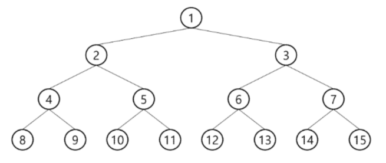
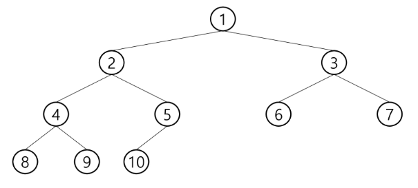
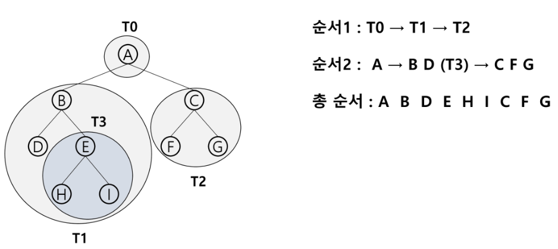
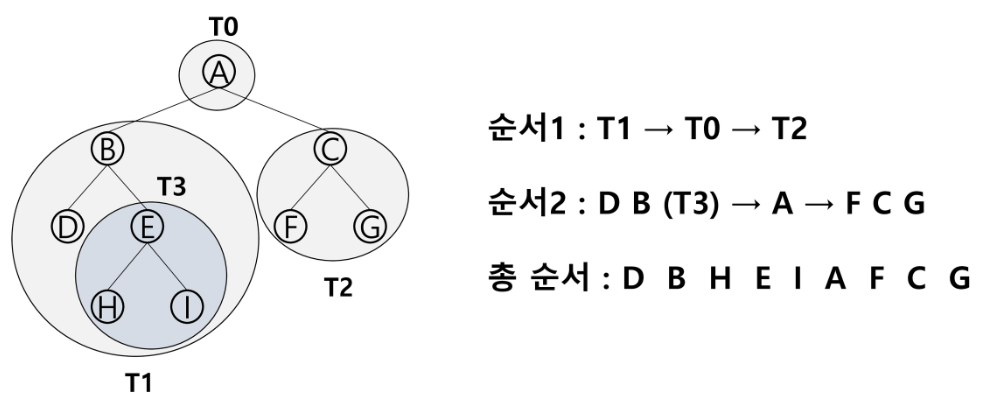
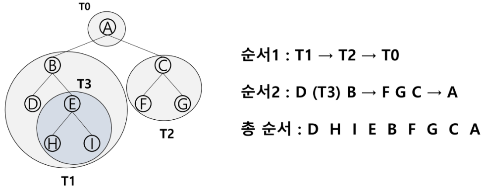
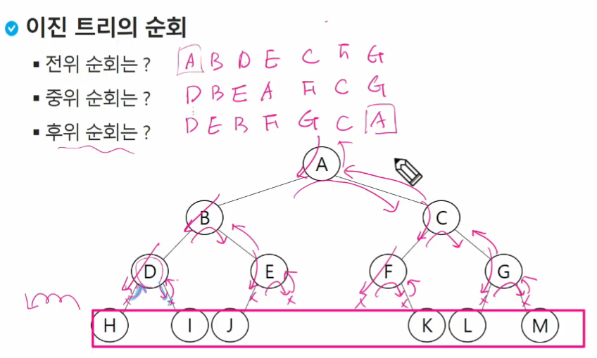
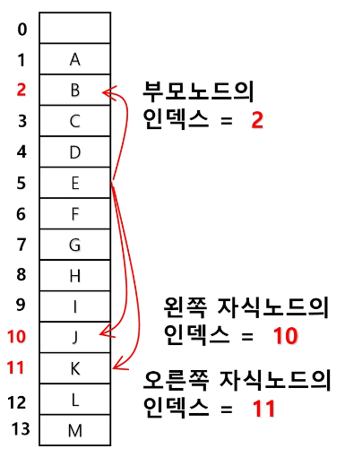
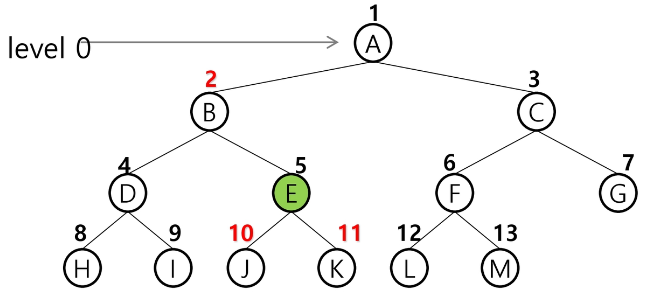
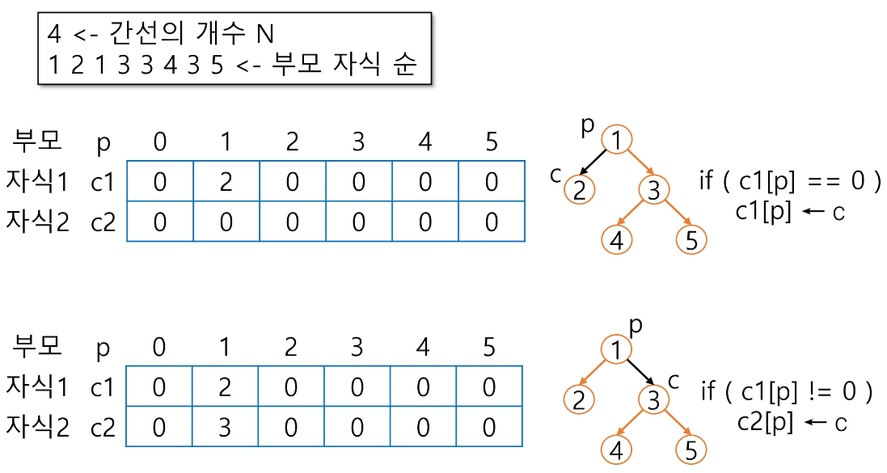
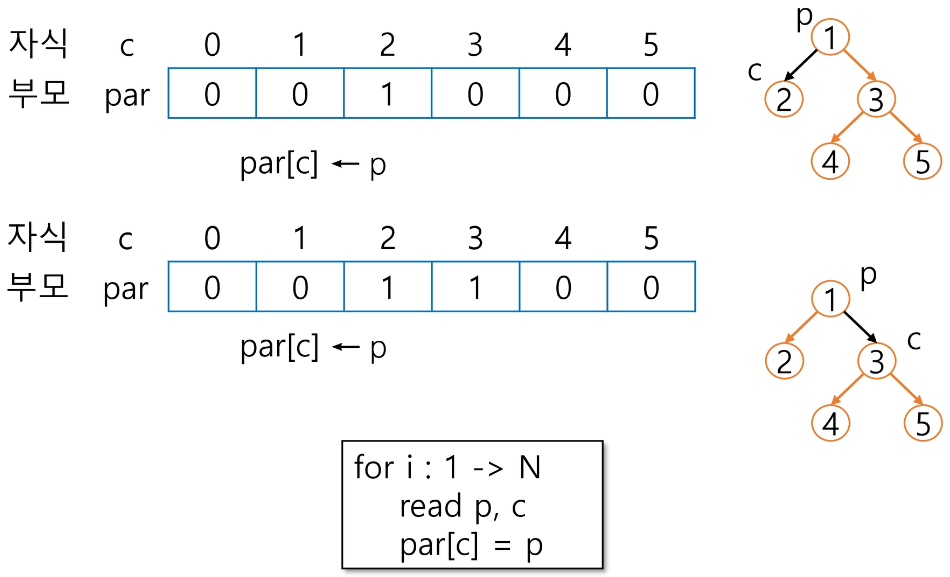

## 트리
- 원소들 간에 1 : n 관계를 가지는 자료구조, 비선형 구조
- 원소들 간에 계층관계를 가지는 계층형 자료구조
- 차수
    - 노드의 차수 : 노드에 연결된 자식 노드의 수
    - 트리의 차수 : 트리에 있는 노드의 차수 중에서 가장 큰 값
    - 단말 노드(리프 노드) : 차수가 0인 노드, 자식노드가 없는 노드
### 이진트리
- 모든 노드들이 2개의 서브 트리를 갖는 형태의 트리
- 레벨 i 에서의 노드의 최대 개수는 2**i 개
- 높이가 h 인 이진 트리가 가질 수 있는 노드의 최소 개수는 h + 1개가 되며, 최대 개수는 2**(h + 1) - 1 개가 된다
- 포화 이진 트리 *Full Binary Tree*
    - 모든 레벨의 노드가 포화상태로 차 있는 이진 트리
    - 루트를 1번으로 하여 2**(h + 1) - 1 까지 정해진 위치에 대한 노드 번호를 가진다
    
- 완전 이진 트리 *Complete Binary Tree*
    - 높이가 h 이고 노드 수가 n 개일 때, 노드 번호 1번부터 n 번까지 빈자리가 없는 이진트리
    
- 평향 이진 트리 *Skewed Binary Tree*
    - 높이 h 에 대한 최소 개수의 노드를 가지면서 한쪽방향의 자식 노드만을가진 이진트리
    - 왼쪽 편향 이진 트리
    - 오른쪽 편향 이진 트리
- 순회 *Traversal*
    - 트리의 각 노드를 중복되지 않게 전부 방문하는 것
    - 전위순회 *Preorder traversal*  VLR
    
        ```python
        def preorder_traverse(T):
            if T:
                visit(T)
                preorder_traverse(T.left)
                preorder_traverse(T.right)
        ```
    - 중위순회 *Inorder traversal*   LVR
    
        ```python
        def Inorder_traverse(T):
            if T:
                Inorder_traverse(T.left)
                visit(T)
                Inorder_traverse(T.right)
        ```
    - 후위순회 *Postorder traversal* LRV
      
        ```python
        def postorder_traverse(T):
            if T:
                postorder_traverse(T.left)
                postorder_traverse(T.right)
                visit(T)
        ```
    
- 배열을 이용한 이진 트리의 표현</br>
    <p align="center">
    
    
    <figcaption align="center"></figcaption>
    </p>

- 부모 번호를 인덱스로 자식 번호를 저장
    
- 자식 번호를 인덱스로 부모 번호를 저장
    
- 루트 찾기, 조상 찾기
    ```python
    c = 5
    while a[c] != 0:
        c = a[c]
        anc.append(c)
    root = c
    ```
